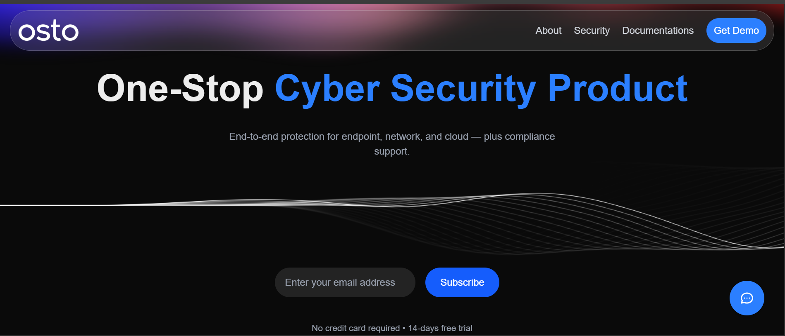
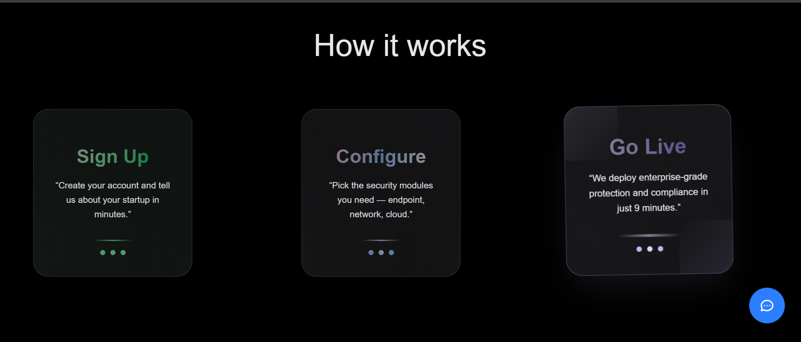
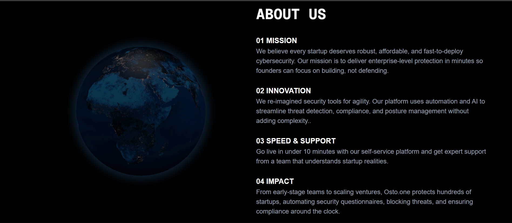
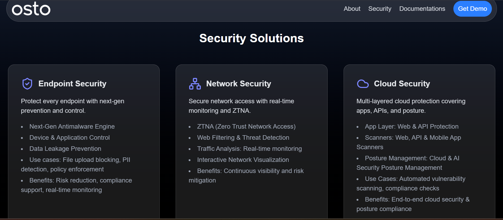

# 🛡️ Osto.one – p1-frontend

A modern, responsive **Next.js** frontend for Osto.one — a cybersecurity platform delivering enterprise-grade protection for startups.  
This project is built with **Next.js 15**, **React 19**, **Tailwind CSS** and enhanced with cutting-edge libraries like **Three.js** for 3D visuals, **react-globe.gl** for interactive globes, and **lucide-react** for crisp icons.

---

## ✨ Features

- ⚡ **Blazing-fast Next.js frontend** with server components & optimized routing.
- 🖥️ **Responsive UI** with glassmorphism styling and smooth scroll effects (Lenis).
- 🌐 **Interactive 3D elements** using `@react-three/fiber` and `@react-three/drei`.
- 🌎 **Global visualization** with `react-globe.gl`.
- 🖌️ **Modern iconography** via `lucide-react`.

---

## 🛠️ Tech Stack

- **Framework:** [Next.js 15](https://nextjs.org)
- **UI:** Tailwind CSS + glassmorphism components
- **3D / Graphics:** Three.js, @react-three/fiber, @react-three/drei, OGL
- **Animations & Smooth Scroll:** Lenis
- **Icons:** lucide-react
- **Globe Visualization:** react-globe.gl

---

## 🚀 Getting Started

Clone the repo and install dependencies:

```bash
git clone https://github.com/your-username/p1-frontend.git
cd p1-frontend
npm install
```

Run the development server:

```bash
npm run dev
```

Open [http://localhost:3000](http://localhost:3000) with your browser to see the result.

Build for production:

```bash
npm run build
npm run start
```

---

## 📸 Screenshots / Gallery

Below is a grid for your app screenshots.  

| Landing Page | How it works | About Page | Security Page |
|--------------|-----------------------|----------------------|---------------------|
|  |  |  |  |


---

## 🌐 Live Demo

View the deployed site here:  
[**https://p1frontend.vercel.app/**](https://p1frontend.vercel.app/)

---

## 🤝 Contributing

1. Fork the repository
2. Create a feature branch (`git checkout -b feature-name`)
3. Commit your changes (`git commit -m 'Add feature'`)
4. Push to the branch (`git push origin feature-name`)
5. Open a Pull Request

---

## 📄 License

This project is licensed under the MIT License.

---

### 🙌 Acknowledgements

- [Next.js](https://nextjs.org)
- [Three.js](https://threejs.org)
- [react-three-fiber](https://docs.pmnd.rs/react-three-fiber/getting-started/introduction)
- [lucide-react](https://lucide.dev)
- [react-globe.gl](https://react-globe.gl)
- [Lenis](https://lenis.studiofreight.com)

## Made with ❤️ by 
Dilpreet Singh Sainbhee
Aaditya Tyagi 